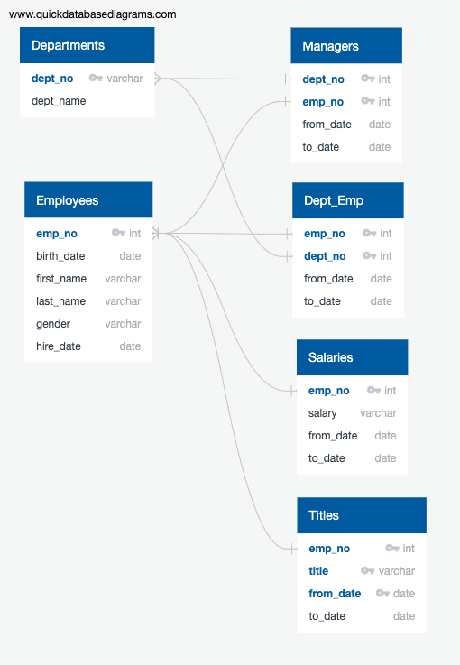

# Pewlett-Hackard-Analysis

  In this analysis we used the data provided to determine the number of employees at Pewlett Hackard that are retiring and the number of employees eligible for a retirement package in order to help the company prepare for the future. The suggested solution for replacing these positions (as a significant portion of the employees at Pewlett Hackard are of retiring age) was to implement a mentorship program in which outgoing employees stay on part-time to mentor their replacements. The data for employees that are eligible for the mentorship program can be found in this analysis as well as the employees eligible for retirement, the employees eleigible for retirement by department, and the employees eligible for retirement by title.
  
  
  The first task of this analysis was to create a list of current employees who are eligible for retirement. This list was generated by selecting the employee number, first name, and last name from the provided list of all employees at the company and filtering for a birth date between 1952 and 1955 as well as a hire date between 1985 and 1988.

-- Create a table for retireing employees.
SELECT emp_no, first_name, last_name
INTO retirement_info
FROM employees
WHERE (birth_date BETWEEN '1952-01-01' AND '1955-12-31')
AND (hire_date BETWEEN '1985-01-01' AND '1988-12-31');  

This table included former employees as well, so an additional list including only active workers was needed. This was acheived by merging the additional list of retiring employees with the list of employees in each department, as it included the "to_date" data.  

SELECT ri.emp_no,
	ri.first_name,
	ri.last_name,
de.to_date
INTO current_emp
FROM retirement_info as ri
LEFT JOIN dept_emp as de
ON ri.emp_no = de.emp_no
WHERE de.to_date = ('9999-01-01');

Next we created a count of employees retiring from each department. This was done by joining the "current_emp" table with the provided department data and using the COUNT function to count the number of retiring employees for each department.

SELECT COUNT(ce.emp_no), 
	de.dept_no
INTO current_emp_dept
FROM current_emp as ce
LEFT JOIN dept_emp as de
ON ce.emp_no = de.emp_no
GROUP BY de.dept_no
ORDER BY de.dept_no;

Additional tables were created to satisfy some of the managers' requests. One was to consolidate the provided employee information into one table including their unique employee number, their last name, first name, gender, and salary. Another was table was generated to include a list of the managers' information, including employee number, last name, first name, and the starting and ending employment dates. The Sales manager requested that a list be created for the sales and development teams containing the employee numbers, employee first name, employee last name, and the employee department name for employees eligible for retirement/mentor program (see code below).

-- Sales and Development ritirees
SELECT ce.emp_no,
	ce.first_name,
	ce.last_name,
	d.dept_name	
INTO mentors_info
FROM current_emp as ce
INNER JOIN dept_emp AS de
ON (ce.emp_no = de.emp_no)
INNER JOIN departments AS d
ON (de.dept_no = d.dept_no)
WHERE d.dept_name IN ('Sales', 'Development');

The final set of lists contained the retiring employees by title, and a list of employees eligible for the mentorship program. The first of these was created by generating a table containing employee number, first and last name, title, from_date and salary. Since many employees have held more than one title throughout their careers at Pewlett Hackard, the list contains only currently held positions. We also created a count of how many employees will be retiring from each position. The final list contains employees eligible for the mentorship program, meaning they had to be born in 1965.

  The results of our analysis show that a large exudus of retirees, 33,118, is going to occur over the next few years at Pewlett Hackard. The most affected department will be Development with 9,281 eligible retirees, followed by Production and Sales with 8,174 and 5,860 eligible retirees respectivley. The most affected role will be Engineers, of which 13,651 are eleigible for retirement. There are only 1,549 employees eligible for the mentorship program under the current parameters (born in 1965) so the program may need to be expanded in order to train enough hirees to fill the soon to be vacant roles. For example, 539 Senior engineers would be responsible for training to fill the 13,651 individuals replacing outgoing retirees. Some additional information that should be included would be a table containing a count of eligible mentors by department and title. I would also suggest additional analysis on outgoing salaries and the cost of retirement packages.

